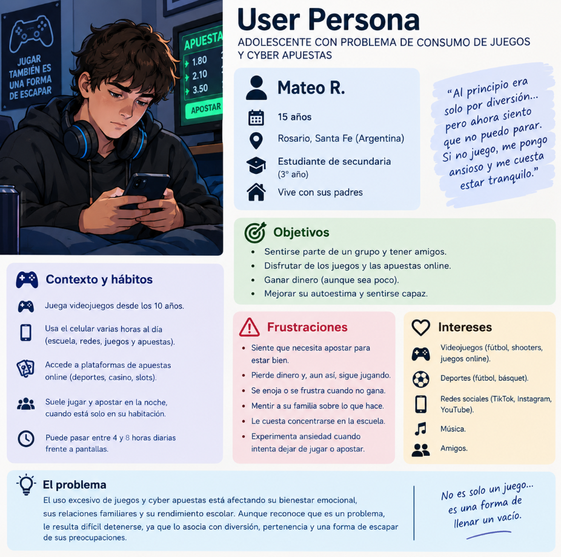
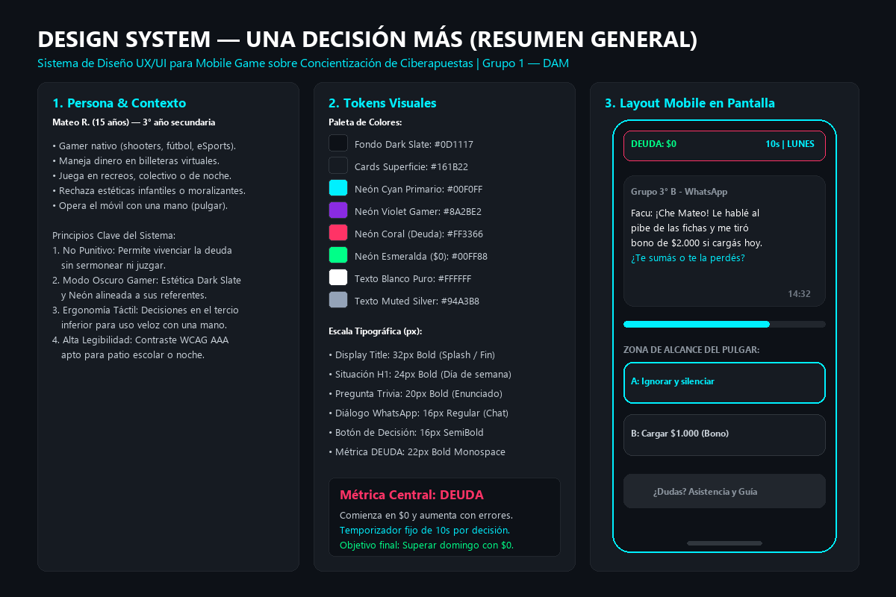
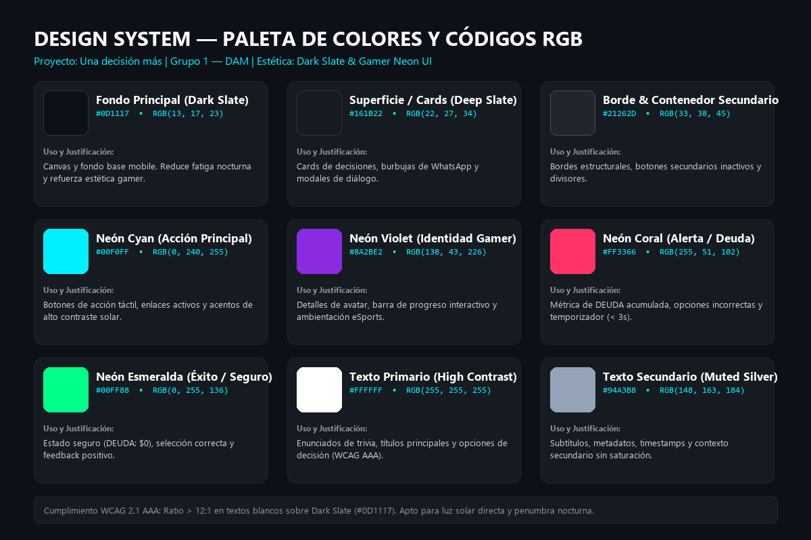
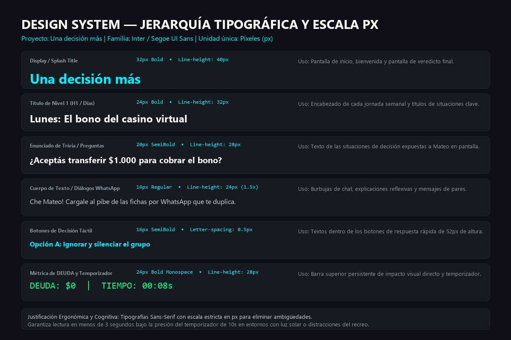
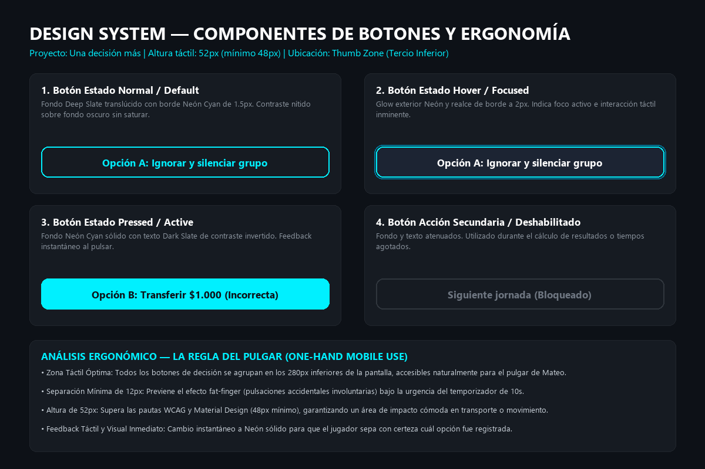

# Una decisión más — Concientización sobre Ciberapuestas en Adolescentes

> **Instituto de Formación Técnica Superior N° 18 (IFTS 18)**  
> **Carrera:** Tecnicatura Superior en Desarrollo de Software  
> **Materia:** Desarrollo para Aplicaciones Móviles (DAM)  
> **Comisión / Ciclo:** 2do Cuatrimestre  
> **Número de Grupo:** Grupo 1  

---

## 👥 Integrantes y Roles

| Integrante | Rol en el Proyecto | Responsabilidades Principales |
| :--- | :--- | :--- |
| **Martín Jonás Avilas** | **Líder IT** | Coordinación técnica grupal, administración del repositorio de GitHub, control de versiones, revisión de entregables y gestión de ramas/commits. |
| **Roberto Araujo** | **Diseñador UX / Fundamentación** | Fundamentación teórica neurobiológica, diseño de la identidad visual, definición del Design System inicial, especificación de paleta RGB y contraste WCAG. |
| **Evelyn Gaitan** | **Narrative Designer / UX Writer** | Redacción de la experiencia narrativa, elaboración del relato de partida completa (`relato.md`), benchmark de aplicaciones y diseño de identidad visual. |
| **Juan Chaile** | **Game Designer & Prototipado** | Modelado de mecánicas de juego, estructura de la dinámica de trivia contrarreloj, flujo interactivo y maquetación de pantallas en tablero Figma. |
| **Lucía Marisol Pobeda** | **Investigadora UX / User Persona** | Investigación de campo, relevamiento de público objetivo, diseño y modelado de la Persona Usuaria (Mateo R.) y maquetación en Figma. |

---

## 🎯 Temática Elegida

**Consumo problemático de apuestas digitales y ciberapuestas en adolescentes.**

La temática se seleccionó ante el incremento alarmante del juego compulsivo en entornos escolares y deportivos, facilitado por la proliferación de billeteras virtuales sin control parental estricto, la publicidad masiva de casinos online con influencers y el uso de cajeros clandestinos por WhatsApp. Se enfoca en concientizar sobre el riesgo psicosocial y la inmadurez biológica de la corteza prefrontal para regular impulsos de recompensa intermitente.

---

## 🎮 Breve Descripción del Juego

**"Una decisión más"** es una experiencia móvil interactiva que combina el formato de **novela gráfica** con mecánicas de **trivia dinámica contrarreloj** (10 segundos por decisión). 

El jugador encarna a **Mateo (15 años)** durante una semana escolar (de lunes a domingo). Mateo se ve expuesto a situaciones realistas y de presión social: ofertas de bonos iniciales, falsas certezas sobre apuestas de fútbol, la trampa de perseguir pérdidas para recuperar dinero (*chasing losses*), capturas engañosas de ganancias en redes y el mito de que "borrar la app elimina la deuda".

### Mecánica Clave:
* **Métrica Central (`DEUDA: $0`):** Visible y permanente en el margen superior de la pantalla. Si el jugador identifica y elige la respuesta preventiva adecuada en menos de 10 segundos, la deuda se mantiene en `$0`. Si elige impulsivamente o el tiempo expira, la deuda monetaria se incrementa de forma automática.
* **Objetivo:** Concluir el domingo con `$0` de deuda, logrando superar las trampas cognitivas y entendiendo cuándo y cómo solicitar orientación a un adulto o a canales oficiales de salud mental.

---

## 🔗 Enlace al Tablero de Diseño Compartido

* 🎨 **Tablero de Diseño en Figma (Abierto y Compartido):**  
  [Neon App UI (Community) – Tablero Oficial en Figma](https://www.figma.com/design/bzjU3l80OI4mZELeOXOe39/Neon-App-UI--Community-?node-id=0-1&p=f&t=gZUvsA5NlCMdfpsa-0)

### Documentos de Referencia del Equipo:
* 📊 **Planificación y División de Roles:** [Organización TP - Diseño de Juego UX/UI (Google Sheets)](https://docs.google.com/spreadsheets/d/1dQfBnHYNf5ZDdArd4o_fG_jp4r-J3kOh6mL_5OXK1Io/edit?gid=0#gid=0)
* 📖 **Relato de Partida Original:** [relato.md en Google Drive](https://drive.google.com/file/d/1aK7mhFvTopTQNQfm2dH9nnQu0W70Lvgi/view) | [relato.md en Google Docs](https://docs.google.com/document/d/1t7ItZvKNfDwme_Ypbbm4-Dhwos6qhyPfVJf0wC_hLJI/edit?tab=t.0#heading=h.olw9768mo0il)
* 📝 **Documento de Fundamentación Visual:** [Entrega Punto 2 - Identidad Visual y Justificación](https://docs.google.com/document/d/18Xs9L_xJuyuiemgHyWBEtqzcqTfoiPNxvWeFnw5i3ms/edit?usp=sharing)
* 📄 **Relato Completo en el Repositorio:** [relato.md](relato.md)

---

## 🖼️ Galería del Design System (`img/`)

### 1. Persona Usuaria
Ficha exhaustiva del usuario modelo **Mateo R. (15 años)**, sus hábitos de consumo digital, contexto familiar/escolar, objetivos, frustraciones y problemática de inicio.



---

### 2. Design System General y Layout Mobile
Resumen integrado del sistema de diseño: principios de interfaz *Gamer Dark / Neon UI*, escala de tipografías, componentes interactivos y esquema ergonómico en pantalla móvil.



---

### 3. Paleta de Colores y Códigos RGB
Especificación técnica de la paleta cromática con valores HEX y RGB, contraste WCAG 2.1 AAA y justificación contextual de uso.



| Color / Token | Valor HEX | Valor RGB | Función y Uso en la Interfaz |
| :--- | :--- | :--- | :--- |
| **Fondo Principal (Dark Slate)** | `#0D1117` | `RGB(13, 17, 23)` | Canvas base. Reduce la fatiga visual nocturna en la habitación de Mateo y refuerza la estética gamer. |
| **Superficie / Cards** | `#161B22` | `RGB(22, 27, 34)` | Contenedores de diálogos de WhatsApp, tarjetas de situaciones y modales. |
| **Contenedor Secundario** | `#21262D` | `RGB(33, 38, 45)` | Bordes estructurales, divisores y botones secundarios inactivos. |
| **Neón Cyan (Acción Principal)** | `#00F0FF` | `RGB(0, 240, 255)` | Botones de decisión táctil, opciones interactivas y acentos de alto contraste a plena luz solar. |
| **Neón Violet (Identidad Gamer)** | `#8A2BE2` | `RGB(138, 43, 226)` | Personalización de avatar, barra de progreso interactivo y acentos eSports. |
| **Neón Coral (Alerta / Deuda)** | `#FF3366` | `RGB(255, 51, 102)` | Indicador crítico de `DEUDA`, opciones erróneas y parpadeo de los últimos 3 segundos del temporizador. |
| **Neón Esmeralda (Éxito / Seguro)** | `#00FF88` | `RGB(0, 255, 136)` | Estado seguro (`DEUDA: $0`), selección correcta y pantalla de victoria dominical. |
| **Texto Primario (High Contrast)** | `#FFFFFF` | `RGB(255, 255, 255)` | Títulos, enunciados de trivia y texto de opciones (Ratio > 12:1 WCAG AAA). |
| **Texto Secundario (Muted Silver)**| `#94A3B8` | `RGB(148, 163, 184)` | Metadatos, timestamps de mensajes y etiquetas auxiliares sin recargar la pantalla. |

---

### 4. Jerarquía Tipográfica y Escala en Píxeles (px)
Escala tipográfica unificada en `px` para garantizar consistencia entre plataformas móviles y rapidez de lectura bajo presión de tiempo.



* **Display / Splash Title (32px Bold, line-height 40px):** Pantalla de inicio, bienvenida y evaluación final.
* **Título H1 / Días de Semana (24px Bold, line-height 32px):** Encabezados de jornada (Lunes a Domingo) y situaciones de impacto.
* **Enunciado de Trivia (20px SemiBold, line-height 28px):** Preguntas y encrucijadas decisionales expuestas a Mateo.
* **Cuerpo / Diálogos WhatsApp (16px Regular, line-height 24px):** Mensajes en formato chat de compañeros y descripciones reflexivas.
* **Botones de Decisión Táctil (16px SemiBold, letter-spacing 0.5px):** Opciones de respuesta en botones de 52px de alto.
* **Métrica de DEUDA y Temporizador (22px Bold Monospace):** Panel numérico superior de visualización instantánea.

---

### 5. Botones y Ergonomía del Pulgar (Thumb Zone)
Especificación de estados táctiles de botones y análisis ergonómico para uso con una sola mano.



* **Altura Táctil:** 52px (supera la recomendación mínima de 48px de accesibilidad para móviles).
* **Ubicación:** Concentrados en el tercio inferior de la pantalla (*Thumb Zone*), optimizados para manipulación con el pulgar mientras el usuario viaja en transporte público o camina por la escuela.
* **Separación:** Espaciado vertical de 12px entre opciones para evitar pulsaciones erróneas involuntarias (*fat-finger effect*) durante los 10 segundos de la trivia.
* **Estados Interactivos:** Normal (borde neón sutil), Hover/Focus (resplandor cian), Pressed (relleno sólido contrastado) y Deshabilitado (opacidad atenuada).

---

## 🚀 Estructura del Repositorio

```text
├── README.md              # Documentación central, integrantes, roles, figma y galería
├── relato.md              # Relato completo de la partida y matriz de trivia semanal
└── img/                   # Capturas y especificaciones visuales requeridas
    ├── persona_usuaria.png # Ficha oficial de Mateo R. (Persona Usuaria)
    ├── design_system.png   # Panel maestro de Design System y layout mobile
    ├── colores_rgb.png     # Paleta con códigos HEX y RGB + Justificación
    ├── tipografias.png     # Escala y jerarquía tipográfica en píxeles (px)
    └── botones.png         # Componentes de botones, estados y ergonomía del pulgar
```

---

## 📌 Guía de Participación para Colaboradores (Commits Requeridos)

Cada integrante del equipo debe realizar al menos **un commit propio** en el repositorio para registrar su participación individual en la entrega. En la sección final de este documento se detallan los comandos paso a paso para clonar, editar y confirmar cambios.
