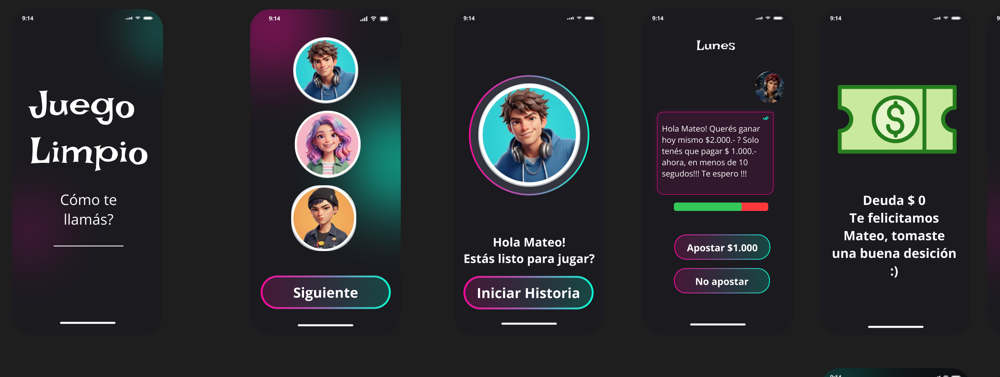

# Una decisión más — Concientización sobre Ciberapuestas en Adolescentes

> **Instituto de Formación Técnica Superior N° 18 (IFTS 18)**  
> **Carrera:** Tecnicatura Superior en Desarrollo de Software  
> **Materia:** Desarrollo para Aplicaciones Móviles (DAM)  
> **Comisión / Ciclo:** 2do Cuatrimestre  
> **Número de Grupo:** Grupo 1  

---

## 👥 Integrantes y Roles

| Integrante | Rol en el Proyecto | Responsabilidades Principales |
| :--- | :--- | :--- |
| **Martín Jonás Avilas** | **Líder IT** | Coordinación técnica grupal, administración del repositorio de GitHub, control de versiones, revisión de entregables y gestión de ramas/commits. |
| **Roberto Araujo** | **Diseñador UX / Fundamentación** | Fundamentación teórica neurobiológica, diseño de la identidad visual, definición del Design System inicial, especificación de paleta RGB y contraste WCAG. |
| **Evelyn Gaitan** | **Narrative Designer / UX Writer** | Redacción de la experiencia narrativa, elaboración del relato de partida completa (`relato.md`), benchmark de aplicaciones y diseño de identidad visual. |
| **Juan Chaile** | **Game Designer & Prototipado** | Modelado de mecánicas de juego, estructura de la dinámica de trivia contrarreloj, flujo interactivo y maquetación de pantallas en tablero Figma. |
| **Lucía Marisol Pobeda** | **Investigadora UX / User Persona** | Investigación de campo, relevamiento de público objetivo, diseño y modelado de la Persona Usuaria (Mateo R.) y maquetación en Figma. |

---

## 🎯 Temática Elegida

**Consumo problemático de apuestas digitales y ciberapuestas en adolescentes.**

La temática se seleccionó ante el incremento alarmante del juego compulsivo en entornos escolares y deportivos, facilitado por la proliferación de billeteras virtuales sin control parental estricto, la publicidad masiva de casinos online con influencers y el uso de cajeros clandestinos por WhatsApp. Se enfoca en concientizar sobre el riesgo psicosocial y la inmadurez biológica de la corteza prefrontal para regular impulsos de recompensa intermitente.

---

## 🎮 Breve Descripción del Juego

**"Una decisión más"** es una experiencia móvil interactiva que combina el formato de **novela gráfica** con mecánicas de **trivia dinámica contrarreloj** (10 segundos por decisión). 

El jugador encarna a **Mateo (15 años)** durante una semana escolar (de lunes a domingo). Mateo se ve expuesto a situaciones realistas y de presión social: ofertas de bonos iniciales, falsas certezas sobre apuestas de fútbol, la trampa de perseguir pérdidas para recuperar dinero (*chasing losses*), capturas engañosas de ganancias en redes y el mito de que "borrar la app elimina la deuda".

### Mecánica Clave:
* **Métrica Central (`DEUDA: $0`):** Visible y permanente en el margen superior de la pantalla. Si el jugador identifica y elige la respuesta preventiva adecuada en menos de 10 segundos, la deuda se mantiene en `$0`. Si elige impulsivamente o el tiempo expira, la deuda monetaria se incrementa de forma automática.
* **Objetivo:** Concluir el domingo con `$0` de deuda, logrando superar las trampas cognitivas y entendiendo cuándo y cómo solicitar orientación a un adulto o a canales oficiales de salud mental.

---

## 🔗 Enlace al Tablero de Diseño Compartido

* 🎨 **Tablero de Diseño en Figma (Abierto y Compartido):**  
  [Neon App UI (Community) – Tablero Oficial en Figma](https://www.figma.com/design/bzjU3l80OI4mZELeOXOe39/Neon-App-UI--Community-?node-id=0-1&p=f&t=gZUvsA5NlCMdfpsa-0)

### Documentos de Referencia del Equipo:
* 📊 **Planificación y División de Roles:** [Organización TP - Diseño de Juego UX/UI (Google Sheets)](https://docs.google.com/spreadsheets/d/1dQfBnHYNf5ZDdArd4o_fG_jp4r-J3kOh6mL_5OXK1Io/edit?gid=0#gid=0)
* 📖 **Relato de Partida Original:** [relato.md en Google Drive](https://drive.google.com/file/d/1aK7mhFvTopTQNQfm2dH9nnQu0W70Lvgi/view) | [relato.md en Google Docs](https://docs.google.com/document/d/1t7ItZvKNfDwme_Ypbbm4-Dhwos6qhyPfVJf0wC_hLJI/edit?tab=t.0#heading=h.olw9768mo0il)
* 📝 **Documento de Fundamentación Visual:** [Entrega Punto 2 - Identidad Visual y Justificación](https://docs.google.com/document/d/18Xs9L_xJuyuiemgHyWBEtqzcqTfoiPNxvWeFnw5i3ms/edit?usp=sharing)
* 📄 **Relato Completo en el Repositorio:** [relato.md](relato.md)

---

## 🖼️ Galería del Design System (`img/`)

### 1. Persona Usuaria
Ficha exhaustiva del usuario modelo **Mateo R. (15 años)**, sus hábitos de consumo digital, contexto familiar/escolar, objetivos, frustraciones y problemática de inicio.


---

### 2. Design System General y Flujo de Pantallas en Figma
Resumen integrado del sistema de diseño y flujo real de pantallas diseñado en Figma para el juego *Una decisión más / Juego Limpio*:


#### Flujo Continuo de Pantallas (Figma):
1. **Splash / Identificación:** Pantalla de bienvenida con el título *"Juego Limpio"* y campo para ingresar el nombre/apodo.
2. **Personalización de Avatar:** Selección táctil de 3 avatares con anillos luminosos Neón y botón *"Siguiente"*.
3. **Bienvenida al Personaje:** Pantalla de saludo a Mateo (*"¡Hola Mateo! ¿Estás listo para jugar?"*) y botón *"Iniciar Historia"*.
4. **Jornada Lunes (Trivia Contrarreloj):** Diálogo de WhatsApp del cajero clandestino, barra temporal interactiva y botones de respuesta (*"Apostar $1.000"* / *"No apostar"*).
5. **Veredicto y Acompañamiento:** Visualización de deuda (`Deuda $ 0` / `Deuda $ 1.000`) y acceso directo a canales oficiales de orientación (Boti WhatsApp +54 9 11 5050-0147 y Consumo Digital PBA 0800-222-5462).



---

### 3. Paleta de Colores y Códigos RGB (Figma)
Especificación técnica de la paleta cromática real extraída del tablero de Figma con valores HEX y RGB, contraste WCAG 2.1 AAA y justificación contextual de uso.


| Color / Token | Valor HEX | Valor RGB | Función y Uso en la Interfaz |
| :--- | :--- | :--- | :--- |
| **Fondo General (Dark Slate)** | `#0D1117` | `RGB(13, 17, 23)` | Canvas base de la app. Reduce la fatiga visual nocturna en la habitación de Mateo y refuerza la atmósfera gamer. |
| **Burbuja WhatsApp / Cards** | `#24142D` | `RGB(36, 20, 45)` | Fondo de mensajes de chat y tarjetas de situaciones, con borde magenta tenue (`#8E1E5C`). |
| **Neón Fucsia / Magenta (Gradiente)** | `#E91E63` | `RGB(233, 30, 99)` | Inicio del gradiente en bordes de botones píldora (*"Siguiente"*, *"Iniciar Historia"*) y halo de avatar. |
| **Neón Cyan (Gradiente)** | `#00E5FF` | `RGB(0, 229, 255)` | Fin del gradiente en botones, acentos interactivos y resplandor de alto contraste solar. |
| **Verde Éxito (Billete / Deuda $0)** | `#57B956` | `RGB(87, 185, 86)` | Ilustración del billete de dinero, estado seguro `Deuda $ 0` y tramo seguro del temporizador. |
| **Alerta / Tiempo Crítico** | `#FF3B30` | `RGB(255, 59, 48)` | Tramo final de urgencia en la barra de 10s y penalización en caso de selección errónea. |
| **Texto Primario (High Contrast)** | `#FFFFFF` | `RGB(255, 255, 255)` | Títulos, diálogos y texto de botones (Ratio > 12:1 WCAG AAA). |
| **Texto Secundario (Gris Claro)** | `#A0AEC0` | `RGB(160, 174, 192)` | Subtítulos (*"¿Cómo te llamás?"*), metadatos y etiquetas auxiliares. |
| **Acento Violeta / Púrpura** | `#7B2CBF` | `RGB(123, 44, 191)` | Fondo atmosférico en pantallas de selección de avatar y bienvenida. |

---

### 4. Jerarquía Tipográfica y Escala en Píxeles (px)
Escala tipográfica unificada en `px` para garantizar consistencia entre plataformas móviles y rapidez de lectura bajo presión de tiempo.


* **Display / Splash Title (36px Serif Bold, line-height 44px):** Título principal del juego (*"Juego Limpio"*) en pantalla splash.
* **Título H1 / Días de Semana (26px Serif Bold, line-height 34px):** Encabezados de jornada (*"Lunes"*, *"Martes"*) en las pantallas de trivia.
* **Subtítulo / Bienvenida (20px Sans Bold, line-height 28px):** Enunciados e interacción (*"¡Hola Mateo! ¿Estás listo para jugar?"*).
* **Cuerpo / Diálogos WhatsApp (15px Sans Regular, line-height 22px):** Mensajes en formato chat del cajero y compañeros en pantalla.
* **Botones de Flujo y Decisión (18px Sans Bold, letter-spacing 0.5px):** Textos dentro de los botones píldora (*"Iniciar Historia"*, *"Apostar $1.000"*, *"No apostar"*).
* **Indicadores Numéricos y Horario (22px Sans Bold):** Panel superior de deuda (*"Deuda $ 0"*) y reloj contextual (*"[21:14]"*).

---

### 5. Botones y Ergonomía del Pulgar (Thumb Zone)
Especificación de los componentes de botones reales diseñados en Figma, sus estados y análisis ergonómico para uso con una sola mano.


* **Forma y Estilo:** Formato píldora (*border-radius: 9999px*) con borde lineal de 2px en degradé Neón Fucsia-Cyan (`#E91E63` a `#00E5FF`) y fondo oscuro translúcido.
* **Altura Táctil:** 52px (supera la recomendación mínima de 48px de accesibilidad para móviles), asegurando una pulsación cómoda sin errores.
* **Ubicación:** Concentrados en el tercio inferior de la pantalla (*Thumb Zone*), optimizados para manipulación con el pulgar mientras el usuario viaja en colectivo o camina por la escuela.
* **Separación:** Espaciado vertical de 14px entre opciones de decisión (*"Apostar $1.000"* vs. *"No apostar"*) para prevenir el efecto *fat-finger* durante la cuenta regresiva de 10 segundos.

---

## 🚀 Estructura del Repositorio

```text
├── README.md              # Documentación central, integrantes, roles, figma y galería
├── relato.md              # Relato completo de la partida y matriz de trivia semanal
└── img/                   # Capturas y especificaciones visuales del proyecto
    ├── persona_usuaria.png # Ficha oficial de Mateo R. (Persona Usuaria)
    ├── design_system.png   # Panel maestro de Design System y layout mobile
    ├── flujo_pantallas.png # Flujo de pantallas reales diseñadas en Figma
    ├── colores_rgb.png     # Paleta oficial con códigos HEX y RGB (Figma)
    ├── tipografias.png     # Escala y jerarquía tipográfica en píxeles (px)
    └── botones.png         # Componentes reales de botones píldora y ergonomía
```

---

## 📌 Guía de Participación para Colaboradores (Commits Requeridos)

Cada integrante del equipo debe realizar al menos **un commit propio** en el repositorio para registrar su participación individual en la entrega. En la sección final de este documento se detallan los comandos paso a paso para clonar, editar y confirmar cambios.
