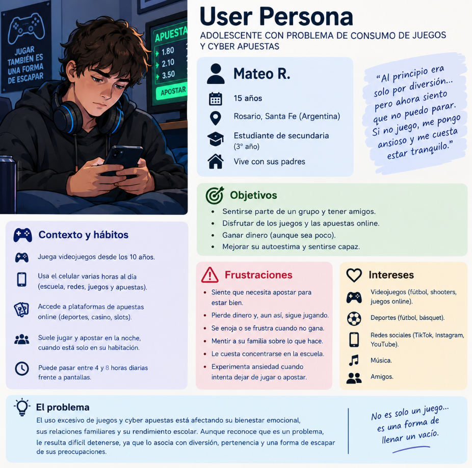
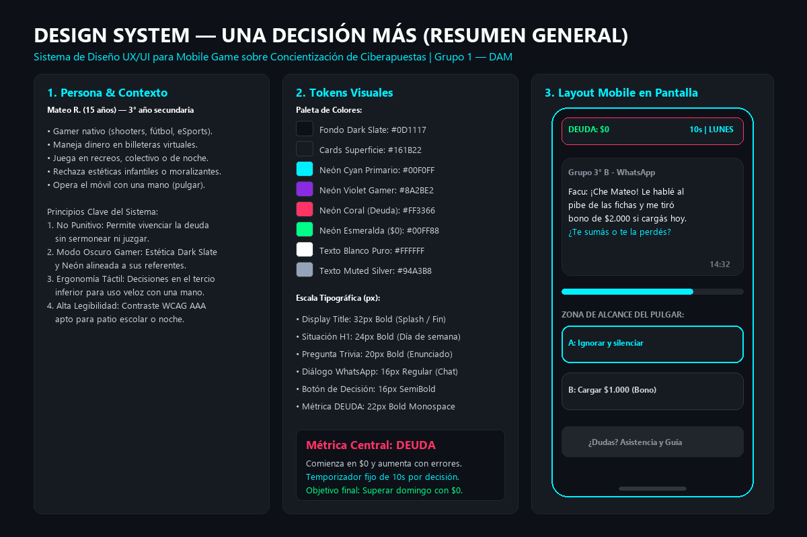
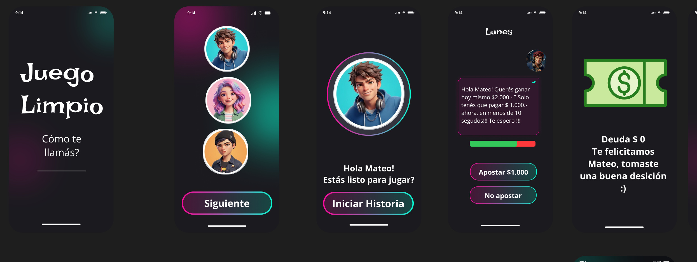
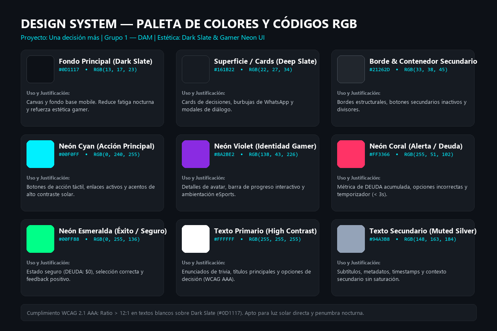
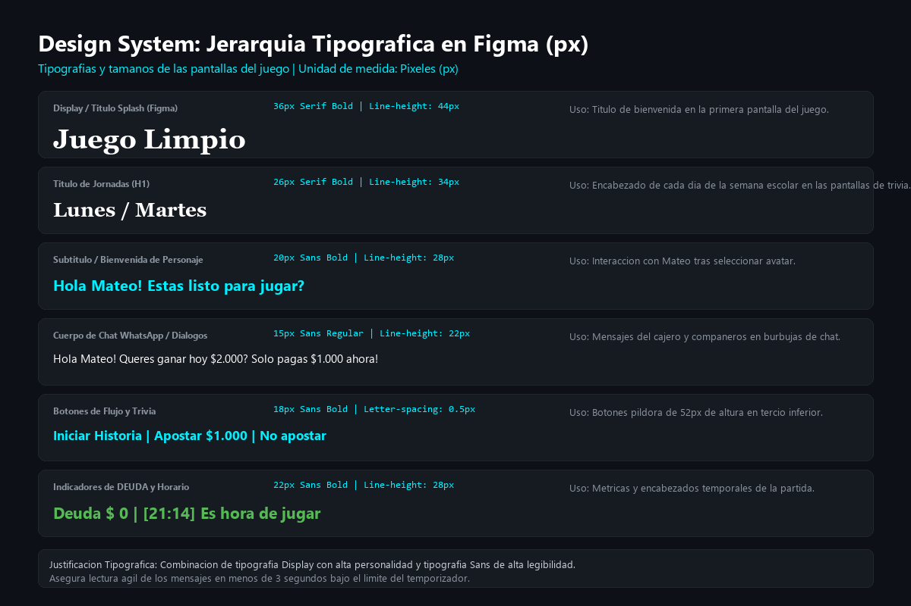
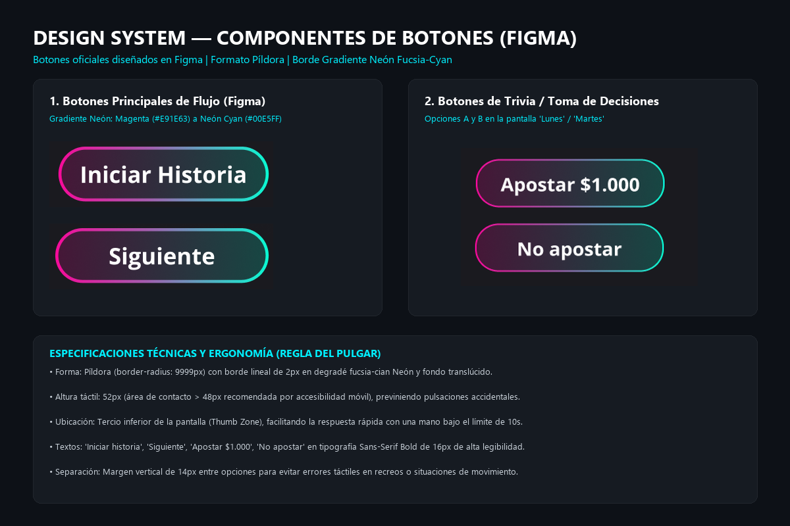

# Juego Limpio - Concientizacion sobre Ciberapuestas en Adolescentes

Instituto de Formacion Tecnica Superior N° 18 (IFTS 18)  
Tecnicatura Superior en Desarrollo de Software  
Desarrollo para Aplicaciones Moviles (DAM)  
Grupo 1  

---

## Integrantes y Roles

| Integrante | Rol en el Proyecto | Responsabilidades |
| :--- | :--- | :--- |
| **Martin Jonas Avilas** | Lider IT | Coordinacion tecnica, repositorio GitHub y control de versiones |
| **Roberto Araujo** | Disenador UX / Fundamentacion | Fundamentacion teorica e identidad visual (colores RGB) |
| **Evelyn Gaitan** | Narrative Designer / UX Writer | Redaccion narrativa, relato de partida y benchmark |
| **Juan Chaile** | Game Designer y Prototipado | Mecanicas de juego, dinamica de trivia y pantallas Figma |
| **Lucia Marisol Pobeda** | Investigadora UX / User Persona | Investigacion de campo, relevamiento y persona usuaria |

---

## Tematica Elegida

Consumo problematico de apuestas digitales y ciberapuestas en adolescentes.

Se eligio esta tematica por su crecimiento en el ambito escolar y deportivo, impulsado por billeteras virtuales, promociones en redes sociales y cajeros por WhatsApp. El objetivo es concientizar sobre los riesgos psicosociales y economicos asociados a este consumo.

---

## Descripcion del Juego

"Juego Limpio" es un juego movil que combina novela grafica interactiva con una trivia contrarreloj de 10 segundos por decision.

El jugador sigue la historia de Mateo (15 anos) a lo largo de una semana (lunes a domingo). Durante la partida, Mateo recibe mensajes y propuestas vinculadas a apuestas online. La pantalla mantiene un marcador visible de "DEUDA: $0". Si el jugador toma decisiones preventivas a tiempo, la deuda no sube; si elige opciones de riesgo o se termina el tiempo, la deuda aumenta. El objetivo es terminar la semana con $0 de deuda.

---

## Enlace al Tablero de Diseno

* Tablero de Figma: [Neon App UI (Community) en Figma](https://www.figma.com/design/bzjU3l80OI4mZELeOXOe39/Neon-App-UI--Community-?node-id=0-1&p=f&t=gZUvsA5NlCMdfpsa-0)
* Planificacion grupal: [Organizacion TP en Google Sheets](https://docs.google.com/spreadsheets/d/1dQfBnHYNf5ZDdArd4o_fG_jp4r-J3kOh6mL_5OXK1Io/edit?gid=0#gid=0)
* Relato completo: [relato.md](relato.md)

---

## Galeria del Design System

### 1. Persona Usuaria
Ficha de Mateo R. (15 anos), estudiante de secundaria, contexto de uso, habitos y problematica analizada.



---

### 2. Design System y Flujo de Pantallas
Resumen visual del sistema de diseno y las pantallas desarrolladas en Figma:



Flujo de pantallas en Figma:
1. Splash inicial ("Juego Limpio") con ingreso de nombre.
2. Seleccion de avatar con anillos neon.
3. Pantalla de bienvenida a Mateo.
4. Trivia de Lunes con chat estilo WhatsApp, barra de tiempo y opciones de decision.
5. Pantalla de resultado ("Deuda $0") y canales de asistencia.



---

### 3. Paleta de Colores y Codigos RGB
Colores definidos a partir del diseno en Figma:



| Color / Token | Hex | RGB | Uso en la Interfaz |
| :--- | :--- | :--- | :--- |
| **Fondo General** | `#0D1117` | `RGB(13, 17, 23)` | Fondo principal en modo oscuro para evitar fatiga visual. |
| **Burbuja Chat** | `#24142D` | `RGB(36, 20, 45)` | Fondo de mensajes estilo WhatsApp con borde magenta. |
| **Borde Magenta** | `#E91E63` | `RGB(233, 30, 99)` | Inicio de gradiente en botones y detalles de avatar. |
| **Borde Cyan** | `#00E5FF` | `RGB(0, 229, 255)` | Fin de gradiente en botones y elementos destacados. |
| **Verde Exito** | `#57B956` | `RGB(87, 185, 86)` | Indicador de resultado positivo y billete de deuda $0. |
| **Rojo Alerta** | `#FF3B30` | `RGB(255, 59, 48)` | Tramo final de la barra de 10s y penalizaciones. |
| **Texto Principal** | `#FFFFFF` | `RGB(255, 255, 255)` | Titulos, dialogos y opciones (alto contraste). |
| **Texto Secundario** | `#A0AEC0` | `RGB(160, 174, 192)` | Subtitulos y textos informativos secundarios. |
| **Acento Violeta** | `#7B2CBF` | `RGB(123, 44, 191)` | Fondo y ambientacion de pantallas de bienvenida. |

---

### 4. Tipografias y Escala en Pixeles (px)
Escala tipografica utilizada en el prototipo:



* **Display / Titulo Splash (36px):** Titulo principal "Juego Limpio" en la pantalla de inicio.
* **Titulos de Dias (26px):** Encabezados "Lunes", "Martes", etc.
* **Subtitulos y Dialogos (20px):** Mensajes de bienvenida y enunciados.
* **Texto de Mensajes (15px):** Burbujas de chat de WhatsApp.
* **Botones (18px):** Textos dentro de los botones de accion ("Iniciar Historia", "Apostar $1.000", "No apostar").
* **Metricas y Horarios (22px):** Marcador "Deuda $0" y reloj en pantalla.

---

### 5. Botones y Ergonomia
Componentes de botones y su disposicion para uso en dispositivos moviles:



* **Forma:** Botones pildora con borde gradiente magenta-cyan y fondo oscuro translucido.
* **Tamano:** Altura de 52px para asegurar un area tactil comoda.
* **Ubicacion:** Ubicados en el tercio inferior de la pantalla para permitir el uso con una sola mano (zona del pulgar).
* **Separacion:** Espacio vertical de 14px entre opciones para evitar pulsaciones accidentales con el temporizador activo.

---

## Decisiones en Torno al Desarrollo

Para encarar el proyecto elegimos Jetpack Compose porque nos resultaba mucho más práctico para armar la interfaz de forma moderna. Al no depender de los archivos XML tradicionales, pudimos armar componentes reutilizables (como los botones estilizados y las tarjetas de mensaje) y mantener el mismo criterio visual en toda la app.

En cuanto al diseño, nos inclinamos por un estilo oscuro con detalles neón. La idea principal fue imitar la estética de las aplicaciones y plataformas que usan los adolescentes, buscando que la experiencia se sienta cercana y real. Por ejemplo, en las pantallas de decisión mostramos las propuestas en formato de chat para simular los mensajes persuasivos que suelen recibir en el celular.

Durante el proceso enfrentamos y resolvimos distintos desafíos técnicos:
* **Compatibilidad del entorno:** En las primeras etapas detectamos discrepancias con la versión de Java y la configuración de Gradle entre los integrantes del equipo, lo cual resolvimos estandarizando las variables del entorno de desarrollo.
* **Flujo de trabajo en Git:** Organizamos la colaboración mediante el uso de ramas individuales en GitHub, asegurando la integración continua del código sin superponer los avances de cada miembro.
* **Ajustes de UI:** Dedicamos tiempo a pulir detalles de diseño en Compose, especialmente en lo referente a bordes redondeados y degradados de color, para garantizar una correcta renderización visual.

Las pantallas actuales corresponden a una primera versión orientada a iteraciones futuras.

---

## Estructura del Repositorio

```text
├── app/
│   ├── src/main/
│   │   ├── AndroidManifest.xml
│   │   ├── java/com/ifts18/unadecisionmas/
│   │   │   ├── MainActivity.kt
│   │   │   ├── navigation/
│   │   │   │   ├── AppNavigation.kt
│   │   │   │   └── Screen.kt
│   │   │   ├── ui/screens/
│   │   │   │   ├── FirstDecisionScreen.kt
│   │   │   │   ├── InfoResourcesScreen.kt
│   │   │   │   └── WelcomeScreen.kt
│   │   │   └── ui/theme/
│   │   │       ├── Color.kt
│   │   │       ├── Theme.kt
│   │   │       └── Type.kt
│   │   └── res/font/
│   │       ├── space_grotesk_bold.ttf
│   │       ├── space_grotesk_medium.ttf
│   │       └── space_grotesk_regular.ttf
│   └── build.gradle.kts
├── img/
│   ├── persona_usuaria.png
│   ├── design_system.png
│   ├── flujo_pantallas.png
│   ├── colores_rgb.png
│   ├── tipografias.png
│   └── botones.png
├── README.md
├── relato.md
└── settings.gradle.kts
```
